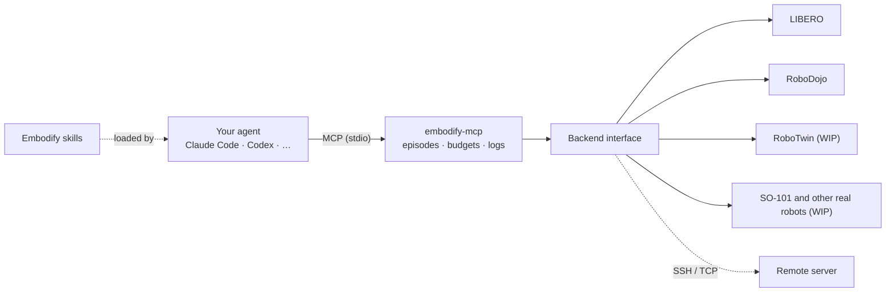

<h1 align="center">Embodify</h1>
<!-- mcp-name: io.github.YidaYang/embodify -->

<p align="center"><b>Give your agent a body.</b></p>

<p align="center"><i>Your best embodied agent is your favorite agent.</i></p>

<p align="center">
Embodify lets the agent you use every day — Claude Code, Codex or any other
MCP-capable agent — see and control robots directly, and keeps everything else
that makes it yours. Bring in frontier models with embodied manipulation skills,
such as GPT-6 Astra and Claude Opus 5.5, and let your AI companion step into the
physical world.
</p>

<p align="center">
<a href="README.zh-CN.md">中文</a> ·
<a href="#one-line-setup">One-line setup</a> ·
<a href="#backends">Backends</a> ·
<a href="#for-research">For research</a> ·
<a href="#skills">Skills</a> ·
<a href="#roadmap">Roadmap</a>
</p>

> **First release (0.1.0a1).** Supports LIBERO and RoboDojo today; support for
> RoboTwin and the LeRobot SO-101 arm is coming soon.

## Why Embodify

Most embodied agents are built from scratch: a dedicated harness wraps a model,
hands it a fixed set of robot actions, and nothing else. The agent you use every
day already has what those harnesses lack:

- **Context and memory.** It manages long sessions and remembers across them.
- **It knows you.** Your preferences, your projects, your lab setup.
- **It talks with you** in the terminal, IDE, desktop app or chat you already
  use. You can ask how it is going, step in, correct it, or teach it mid-task.
- **It has a computer.** It writes and runs code, uses its tools, searches the
  web and reads papers.

Embodify keeps all of that and adds a body. Install the plugin and your agent
gets robot observation and control tools over MCP — a protocol it already uses
for everything else — plus skills that teach it how to operate robots and how
to achieve recursive self-improvement (RSI) from its own experience.

### Why "best"

A general agent with a body is stronger than a harness that can only move a robot:

1. **It can think with tools, not only act.** When a task needs geometry it can
   write a script; when it needs a fact it can search; when it needs perception
   it can run a model.
2. **It keeps track.** Long-horizon manipulation fails when the agent forgets
   what it already tried. Mature agents manage context and memory well.
3. **It works with you.** It asks you when a task is ambiguous, takes your
   guidance when it gets stuck, and remembers your corrections next time.
4. **It controls robots in its native language.** Robot control arrives as
   ordinary MCP tool calls, the same shape as every other tool the agent uses.
5. **It builds on frontier embodied models.** Your agent runs on models with
   frontier embodied manipulation skills, such as GPT-6 Astra and Claude Opus 5.5,
   and every model upgrade makes your robot better, with no retraining.
6. **It improves itself recursively.** It turns every episode into lessons,
   lessons into rules and rules into new skills, and gets better the more it works.
7. **Zero-shot, few-shot and in-context learning come easily.** A general agent
   takes on new tasks without training: describe a task in plain language
   (zero-shot), show it a few examples (few-shot), or put instructions,
   demonstrations and past experience in its context (in-context learning, ICL).

## What's inside

Embodify is an agent plugin with two parts, and installing the plugin gives your agent both:

| Part | What it gives your agent |
|---|---|
| **MCP server** (`embodify-mcp`, registered as `embodify`) | Tools to list tasks, start an episode, observe cameras and robot state, move end effectors, open and close grippers, and coordinate two arms. |
| **Skills** | Know-how: running a careful observe–act loop, keeping a profile of the robot body and cameras, and learning from past episodes. More perception skills are coming soon. |



The MCP server is the front end. Each simulator, benchmark or robot is a
backend behind one small interface, so adding a new one does not change what
the agent sees. Highlights:

- **Works with any MCP host.** No LLM calls inside; your agent keeps its own
  model, memory, skills and tools.
- **One call, one motion.** The control loop runs next to the simulator. Each
  action returns the actual displacement, remaining error, a stop reason and
  fresh camera images.
- **Remote simulation.** Run the simulator on your lab's GPU server over SSH
  while the agent stays on your laptop. Heartbeats keep high-latency links
  alive; if the link drops, the episode aborts cleanly and `reset_task` reconnects.
- **Fair evaluation.** When you use Embodify to evaluate an agent's manipulation
  skills, task success is recorded for humans and never exposed to the agent.
- **Live monitor and replay.** Watch running episodes live in a browser, or
  replay past ones frame by frame.

## Backends

| Backend | Robot | Status |
|---|---|---|
| `fake`, `fake-two-arm` | Kinematic diagnostic, one or two arms | ✅ Included, no simulator needed |
| `libero` | Franka Panda, 130 tasks in 5 suites | ✅ Included |
| `robodojo` | Dual ARX X5, all 54 simulation tasks | ✅ Included |
| RoboTwin | Dual-arm manipulation benchmark | 🚧 Coming soon |
| LeRobot SO-101 | Real robot: 5-DoF arm with gripper | 🚧 Coming soon |
| `remote` | Any backend above, on another machine | ✅ SSH or trusted TCP |

Coming soon: robot arms such as xArm, mobile manipulators, humanoids and
dexterous hands. If there is a simulator or robot you would like us to support,
open a GitHub issue with details about it. We welcome contributions of new backends.

## For research

Embodify doubles as a testbed for the embodied manipulation abilities of
language models and agent frameworks. Run GPT, Claude, Gemini, Qwen and other
models, through Claude Code, Codex or your own agent framework, on the same
simulated benchmarks with the same tools, and compare them directly.

- **Standard benchmarks:** LIBERO (130 tasks in 5 suites) and RoboDojo (54
  tasks), with RoboTwin coming soon.
- **Fair by design:** task success is recorded for evaluators and never shown to
  the agent, and `--lock-task` fixes the scene.
- **Controlled budgets:** episode budgets and per-call step limits are
  configurable and logged.
- **Complete records:** tool calls, robot states and camera frames are saved for
  replay and analysis.

Typical studies include zero-shot robot manipulation by frontier models,
comparisons of agent frameworks on the same model, the effect of skills and
memory, and recursive self-improvement across episodes. See
[citation](docs/citation.md) for how to cite Embodify and what to report.

## Quick start

### One-line setup

Paste this into Claude Code, Codex or any other agent you use:

```text
Install Embodify (https://github.com/YidaYang/embodify) for yourself, then set up a LIBERO environment or connect to my existing simulator.
```

That's it. Your agent installs the Embodify plugin, sets up the simulator and
tells you when to restart the session.
(Agents: follow the [agent setup guide](docs/agent-setup.md).)

### Manual install

Embodify starts its MCP server with [uv](https://docs.astral.sh/uv/), straight
from PyPI. If you do not have uv yet, install it with `python -m pip install uv`
or the [official installer](https://docs.astral.sh/uv/getting-started/installation/).

### Claude Code

```sh
claude plugin marketplace add YidaYang/embodify
claude plugin install embodify@embodify
```

### Codex

```sh
codex plugin marketplace add YidaYang/embodify
codex plugin add embodify@embodify
```

The plugin brings both the MCP server, registered as `embodify`, and the skills.
The server starts on the Fake backend, so you can try the tools right away;
[connect a real simulator](#connect-a-real-simulator) next. It reads its
settings from `~/.embodify/config.json` (see [backend setup](docs/backends.md)).
To check the package on its own, without an agent:

```sh
uvx --from embodify-mcp embodify-mcp-smoke   # end-to-end check: no simulator, GPU or model needed
```

### Other agents

1. Register the server in your agent's MCP configuration using
   [examples/mcp.json](examples/mcp.json).
2. If your agent supports Agent Skills (`SKILL.md` folders), copy or link the
   folders in [plugin/skills/](plugin/skills/) into its skills directory.

Restart the session, then ask your agent something like *"Reset the task,
describe what the cameras show, then raise the gripper 5 cm."*

### Connect a real simulator

Let your agent do this step. Paste:

```text
Connect Embodify to a real simulator for me: set up LIBERO on this machine, or connect to my existing simulator. Follow https://github.com/YidaYang/embodify/blob/main/docs/agent-setup.md.
```

Your agent installs the simulator or connects to yours over SSH, writes the
server settings to `~/.embodify/config.json` and asks you to restart the
session. To do it by hand, see [backend setup](docs/backends.md).

### Watch robots live and replay episodes

Add `"monitor-port": 8765` to `~/.embodify/config.json` and open
http://127.0.0.1:8765 to watch the robot work live, with every camera view,
the robot state and each tool call your agent makes, or to replay any past
episode frame by frame. To browse saved runs without a running server:

```sh
uvx --from embodify-mcp embodify-mcp-monitor   # reads ~/.embodify/runs
```

The monitor listens on localhost only.

## MCP tools

| Tool | Purpose |
|---|---|
| `get_session_info` | Current run, task, step budget and robot state; no images |
| `list_tasks` | Browse the backend's task catalogue |
| `reset_task` | Start an episode and return the first camera images |
| `observe` | Camera images and robot state, without moving |
| `move_relative` | Move one end effector by a translation and optional rotation |
| `set_gripper` | Open or close a gripper |
| `control_arms` | Move several arms together with common progress (two-arm backends) |
| `stop_episode` | End the episode and write its record |

Translations are in meters, rotations in radians, quaternions in xyzw order.
Frames and stop reasons are defined in the [action contract](docs/action-contract.md).

## Skills

The plugin contains these skills:

| Skill | Status | What it does |
|---|---|---|
| [embodied-control](plugin/skills/embodied-control/SKILL.md) | v0 | The observe–act loop: small moves, reading stop reasons, verifying grasps, releasing in a separate call |
| [robot-profile](plugin/skills/robot-profile/SKILL.md) | v0 | Keep a profile of the robot: arms, cameras, frames, calibration and measured behavior |
| [task-experience](plugin/skills/task-experience/SKILL.md) | v0 | Write a lesson after every episode, read relevant lessons before the next, promote repeated lessons to rules |
| [object-segmentation](plugin/skills/object-segmentation/SKILL.md) | Coming soon | Open-vocabulary segmentation of camera images |
| [depth-ranging](plugin/skills/depth-ranging/SKILL.md) | Coming soon | Pixel to 3D position from depth and calibration |

Skills are grouped into three families that will keep growing:

1. **Embodiment knowledge**: how this particular robot is built, where its
   cameras are and how it actually moves.
2. **Manipulation tools**: perception, measurement and planning tools, including
   ideas from work such as [Code as Policies](https://arxiv.org/abs/2209.07753).
3. **Recursive self-improvement**: turning experience into lessons, lessons into
   rules and eventually into new skills, improving recursively.

## Roadmap

- **Backends:** RoboTwin; LeRobot SO-101 as the first real robot, with workspace
  limits, human-judged success and an emergency stop; more real robots and simulators.
- **Embodiments:** mobile manipulators, humanoids, dexterous hands.
- **Observations:** depth images, camera calibration and more through the tools.
- **Skills:** segmentation, depth ranging and other perception tools;
  code-as-policy style tools; a stronger recursive self-improvement loop, and more.

## Development

```sh
python -m pip install -e ".[dev]"
python -m pytest -q
python tools/check_release.py
```

See [contributing](CONTRIBUTING.md), [writing a backend](docs/backend-development.md),
[backend setup](docs/backends.md), [action contract](docs/action-contract.md)
and [security](SECURITY.md).

## License and citation

Original code is licensed under [Apache-2.0](LICENSE). Bundled third-party code
keeps its [original notices](THIRD_PARTY_NOTICES.md). See [citation](docs/citation.md)
for how to cite Embodify.
