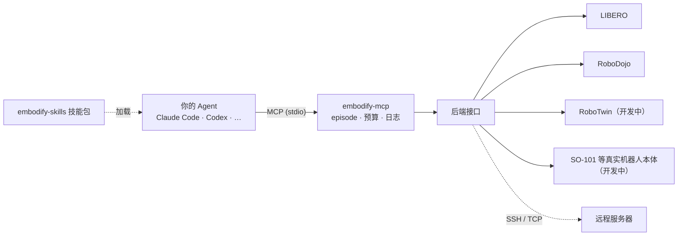

<h1 align="center">Embodify</h1>

<p align="center"><b>给你的 Agent 一个身体。</b></p>

<p align="center">最好的具身 Agent，是你最爱用的那个 Agent。</p>

<p align="center">
Embodify 让你日常使用的 Agent（Claude Code、Codex 或任何支持 MCP 的 Agent）直接看到并控制机器人，
同时保留它原有的一切。接入 GPT-6 Astra 和 Claude Opus 5.5 等具有前沿具身操作能力的语言模型，让你的 AI 伙伴踏入物理世界。
</p>

<p align="center">
<a href="README.md">English</a> ·
<a href="#一句话配置">一句话配置</a> ·
<a href="#后端">后端</a> ·
<a href="#科研用途">科研用途</a> ·
<a href="#技能skills">技能</a> ·
<a href="#路线图">路线图</a>
</p>

> **首个版本（0.1.0a1）。** 现已支持 LIBERO 和 RoboDojo，RoboTwin 与 LeRobot SO-101 机械臂即将获得支持。

## Why Embodify

大多数具身智能体都是从零搭建的：专门的 harness 包住一个模型，给它一组固定的机器人动作，
除此之外什么都没有。而你每天在用的 Agent，恰好具备这些 harness 缺少的东西：

- **上下文与记忆**：能管理长会话，跨会话记住事情。
- **懂你**：你的偏好、你的项目、你实验室的环境。
- **能和你交流**：在你惯用的终端、IDE、桌面端或聊天界面里。你可以询问它的进度，随时插话、纠正、手把手教它。
- **有一台电脑可用**：会写代码、跑代码、用它已有的工具、上网搜索、读论文。

Embodify 保留这一切，只是再给它一个身体。装上插件后，你的 Agent 就能通过 MCP
获得观测和控制机器人的工具（MCP 正是它平时调用各种工具所用的协议），
还有一套教它如何操作机器人、如何从经验中实现递归自我改进（RSI）的技能。

### Embodify 是更好的具身 Agent

拥有身体的通用 Agent，比只能操作机器人的专用 harness 更强：

1. **不只会动手，还会借助工具思考。** 需要几何计算时它能写脚本，需要知识时能搜索，
   需要感知时能调用模型。
2. **记得住。** 长程操作常常败在忘了之前试过什么，而成熟的 Agent 在上下文和记忆管理上已经做得很好。
3. **能和你协作。** 任务有歧义时它会问你，任务做不出时你指导它，下次还记得你的纠正。
4. **用 Agent 的母语控制机器人。** 机器人控制就是普通的 MCP 工具调用，和它用的其他工具形式一样。
5. **构建于 Astra 等前沿具身模型之上。** 直接用上 GPT-6 Astra、Claude Opus 5.5 等具备前沿具身操作能力的模型；模型每次升级，你的机器人能力随之提升，无需重新训练。
6. **实现递归自我改进。** 把每次操作的经验沉淀为教训，把教训沉淀为规则，再发展成新技能，越用越强。
7. **轻松实现 zero-shot、few-shot 和 ICL 具身操作。** 借助通用 Agent 的能力，新任务无需训练就能上手：用自然语言交代任务即可执行（zero-shot），给几个示范就能照着做（few-shot），把说明、演示和过往经验放进上下文就能现学现用（in-context learning，ICL）。

## 包含什么

Embodify 是一个 Agent 插件，由两部分组成：

| 组成 | 给 Agent 带来什么 |
|---|---|
| **MCP 服务**（`embodify-mcp`，在 Agent 中注册为 `embodify`） | 查看任务、开始一个 episode、观测相机和机器人状态、移动末端、开合夹爪、协调双臂的工具。 |
| **技能包**（`embodify-skills`） | 操作经验：谨慎的“观测—行动”循环、记录机器人本体与相机信息、从过往 episode 中总结经验。更多感知类技能即将加入。 |



MCP 服务是前端，每个仿真器、基准或机器人都是同一个小接口背后的后端。
新增后端不会改变 Agent 看到的工具。主要特点：

- **适配任何 MCP 宿主。** 服务内部不调用大模型，模型、记忆、技能和工具都由你的 Agent 自己管理。
- **一次调用，一个动作。** 控制闭环运行在仿真器旁边，每次动作返回实际位移、剩余误差、停止原因和最新的相机画面。
- **支持远程仿真。** 让仿真器跑在实验室的 GPU 服务器上，经 SSH 连接，Agent 留在你的笔记本上。
  通过心跳让高延迟链路保持连接；断线时 episode 会干净中止，再次 `reset_task` 即可重连。
- **支持公平评测。** 使用 Embodify 评测 Agent 的机器人操作能力时，任务成败信息只记录给人看，不暴露给 Agent。
- **回放与实时监控界面。** 在浏览器里实时观看执行中的 episode，或逐帧回放历史记录。

## 后端

| 后端 | 机器人 | 状态 |
|---|---|---|
| `fake`、`fake-two-arm` | 运动学诊断，单臂或双臂 | ✅ 已包含，无需仿真器 |
| `libero` | Franka Panda，5 个 suite 共 130 个任务 | ✅ 已包含 |
| `robodojo` | 双臂 ARX X5，全部 54 个仿真任务 | ✅ 已包含 |
| RoboTwin | 双臂操作基准 | 🚧 即将支持 |
| LeRobot SO-101 |  真实机器人，5 自由度机械臂加夹爪 | 🚧 即将支持 |
| `remote` | 在另一台机器上运行以上任一后端 | ✅ SSH 或可信 TCP |

很快将支持 xArm 等机械臂，可移动机器人、人形机器人和灵巧手。如果你有想要支持的仿真环境或本体，请在 GitHub Issues 提出，并附上相关信息。我们欢迎贡献更多后端适配。

## 科研用途

Embodify 也是评测大模型和 Agent 框架具身操作能力的实验平台。你可以让 GPT、Claude、Gemini、Qwen 等模型通过 Claude Code、Codex 或你自己的 Agent 框架，在同样的仿真基准上、用同样的工具完成任务，直接比较它们的机器人操作能力。

- **标准基准**：LIBERO（5 个 suite 共 130 个任务）和 RoboDojo（54 个任务），RoboTwin 即将支持。
- **评测公平**：任务成败只记录给评测者，不暴露给 Agent；`--lock-task` 可以固定场景。
- **预算可控**：episode 步数预算和单次调用的步数上限都可配置，并记入日志。
- **记录完整**：工具调用、机器人状态和相机画面都会保存，便于回放和分析。

常见的研究方向包括：前沿模型的零样本机器人操作、同一模型在不同 Agent 框架下的对比、技能与记忆的作用，以及跨 episode 的递归自我改进。引用方式和实验中应报告的配置见[引用说明](docs/citation.md)。

## 快速开始

### 一句话配置

把下面这句话发给你的 Claude Code、Codex 或其他 Agent：

```text
请你给自己安装 Embodify（https://github.com/YidaYang/embodify），并配置 LIBERO 环境或连接已有的仿真环境。
```

就这么简单。Agent 会把 MCP 服务和技能装进自己的配置、搭好仿真环境，完成后提醒你重启会话。（Agent 请按照[安装指南](docs/agent-setup.md)操作。）

### 手动安装

需要 Python 3.8+（宿主侧推荐 3.10+）。

```sh
git clone https://github.com/YidaYang/embodify.git
cd embodify
python -m pip install .
embodify-mcp-smoke            # 端到端自检：不需要仿真器、GPU 或模型
```

然后在你的 Agent 里把 MCP 服务注册为 `embodify`，并安装技能包 `embodify-skills`。下面的命令先使用 Fake 后端，装好就能试用各个工具；接着再[连接真实仿真器](#连接真实仿真器)。

### Claude Code

```sh
claude mcp add --scope user embodify -- embodify-mcp --backend fake
claude plugin marketplace add YidaYang/embodify
claude plugin install embodify-skills@embodify
```

### Codex

```sh
codex mcp add embodify -- embodify-mcp --backend fake
codex plugin marketplace add YidaYang/embodify
codex plugin add embodify-skills@embodify
```

仿真器启动可能需要几分钟，请在 `~/.codex/config.toml` 里给服务留足超时：

```toml
[mcp_servers.embodify]
startup_timeout_sec = 120
tool_timeout_sec = 900
```

### 其他 Agent

1. 参照 [examples/mcp.json](examples/mcp.json)，把服务注册进 Agent 的 MCP 配置。
2. 如果 Agent 支持 Agent Skills（`SKILL.md` 目录），把 [embodify-skills/skills/](embodify-skills/skills/) 下的文件夹复制或链接到它的技能目录。

重启会话后，可以对 Agent 说：*“重置任务，描述相机里看到了什么，然后把夹爪抬高 5 厘米。”*

### 连接真实仿真器

这一步交给你的 Agent 来做。把下面这句话发给它：

```text
请按照 https://github.com/YidaYang/embodify/blob/main/docs/agent-setup.md 帮我把 Embodify 连接到真实仿真器：在本机配置 LIBERO，或连接我已有的仿真环境。
```

Agent 会装好仿真器，或经 SSH 连接你已有的仿真器，把 `embodify` 服务指向它，然后提醒你重启会话。想手动配置，请看[后端安装说明](docs/backends.md)。

### 实时观看与回放机器人操作

在服务启动命令里加上 `--monitor-port 8765`，打开 http://127.0.0.1:8765，就能实时观看机器人的操作：每一路相机画面、机器人状态，以及 Agent 的每一次工具调用；也可以逐帧回放任意一次历史 episode。不启动服务、只浏览已保存的记录：

```sh
embodify-mcp-monitor --root out/mcp
```

监控页只监听本机地址。

## MCP 工具

| 工具 | 作用 |
|---|---|
| `get_session_info` | 当前运行、任务、步数预算和机器人状态，不返回图像 |
| `list_tasks` | 浏览后端的任务目录 |
| `reset_task` | 开始一个 episode，返回第一帧相机画面 |
| `observe` | 获取相机画面和机器人状态，不移动 |
| `move_relative` | 按平移和可选的旋转移动一个末端 |
| `set_gripper` | 打开或关闭夹爪 |
| `control_arms` | 以共同进度同时移动多条臂（双臂后端） |
| `stop_episode` | 结束 episode 并写入记录 |

平移单位为米，旋转为弧度，四元数按 xyzw 顺序。坐标系和停止原因的定义见[动作约定](docs/action-contract.md)。

## 技能（Skills）

技能包 `embodify-skills` 包含：

| 技能 | 状态 | 作用 |
|---|---|---|
| [embodied-control](embodify-skills/skills/embodied-control/SKILL.md) | v0 | 观测—行动循环：小步移动、读懂停止原因、确认抓取、单独一次调用松开夹爪 |
| [robot-profile](embodify-skills/skills/robot-profile/SKILL.md) | v0 | 维护机器人档案：臂、相机、坐标系、标定和实测运动表现 |
| [task-experience](embodify-skills/skills/task-experience/SKILL.md) | v0 | 每个 episode 后写一条经验，下次开始前读相关经验，重复出现的经验升级为规则 |
| [object-segmentation](embodify-skills/skills/object-segmentation/SKILL.md) | 即将推出 | 对相机图像做开放词表分割 |
| [depth-ranging](embodify-skills/skills/depth-ranging/SKILL.md) | 即将推出 | 用深度图和标定把像素换算成三维位置 |

技能分为三类，会持续扩充：

1. **本体知识**：这台机器人怎么构成、相机装在哪里、实际怎么运动。
2. **操作工具**：感知、测量和规划工具，包括来自 [Code as Policies](https://arxiv.org/abs/2209.07753) 等工作的思路。
3. **递归自我改进**：把经验沉淀为教训，把教训沉淀为规则，最终生成新技能，并递归地改进下去。

## 路线图

- **后端**：RoboTwin；LeRobot SO-101 作为第一台真机，带工作空间限制、人工判定成败和急停；更多真机和仿真环境。
- **本体**：可移动机器人、人形机器人、灵巧手。
- **观测**：通过工具提供深度图和相机标定等。
- **技能**：分割、深度测距等感知工具；Code as Policies 风格的工具；更强的递归自我改进循环等。

## 开发

```sh
python -m pip install -e ".[dev]"
python -m pytest -q
python tools/check_release.py
```

参见[贡献指南](CONTRIBUTING.md)、[编写后端](docs/backend-development.md)、
[后端安装](docs/backends.md)、[动作约定](docs/action-contract.md)和[安全说明](SECURITY.md)。

## 许可与引用

原创代码采用 [Apache-2.0](LICENSE) 许可。随附的第三方代码保留其[原始声明](THIRD_PARTY_NOTICES.md)。
引用方式见[引用说明](docs/citation.md)。
